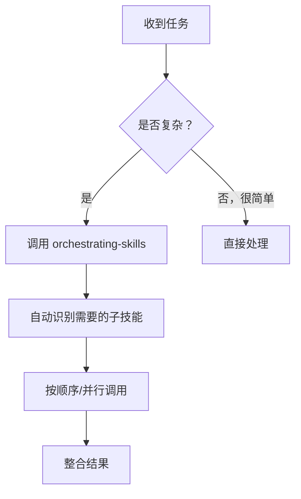

# 技能指挥器（Orchestrating Skills）

## 概述

这是一个**元技能**——它的核心作用是指挥和协调其他所有技能的使用。面对任何复杂任务时，先加载此技能，让系统自动识别并调用最合适的子技能。

## 何时使用

**只要遇到以下情况之一就立即调用：**

- 任务需要多步骤完成
- 涉及多个独立子任务
- 需要不同专业能力的协作（设计 + 实现 + 审查 + 验证）
- 问题比较复杂，单一方法不足以解决
- 你在想"我应该用什么技能？"时

**一句话规则：** 任何非琐碎的任务 → 先调用 `orchestrating-skills` → 它会自动分派其他技能



## 核心工作流

### 1. 任务分析阶段

首先理解任务的本质：

```
任务类型识别：
- 新功能实现     → brainstorming + test-driven-development + verification-before-completion
- Bug 修复        → systematic-debugging + test-driven-development + verification-before-completion  
- 代码审查       → requesting-code-review 或 chinese-code-review
- 大规模迁移/重构 → subagent-driven-development + workflow-runner
- 计划执行       → executing-plans
- 技能/文档创建  → writing-skills
- 调试问题       → systematic-debugging
- 设置配置       → update-config
```

### 2. 技能分派阶段

根据任务类型组合子技能：

**典型组合模式：**

| 场景 | 必需技能序列 |
|------|-------------|
| 新功能 | brainstorming → TDD → 实现 → code-review → verification |
| Bug 修复 | debugging → TDD（针对 bug）→ 修复 → verification |
| 实现计划 | executing-plans 或 subagent-driven-development |
| 技能开发 | writing-skills 工作流（含测试循环）|
| 多模块任务 | parallel-agents → 每个任务用对应技能 |

### 3. 执行与监控

- 并行任务：用 `dispatching-parallel-agents`
- 顺序任务：明确每个阶段的完成标准
- 关键检查点：在进入下一阶段前确认当前阶段完成

### 4. 整合与验收

- 汇总所有子任务结果
- 用 `verification-before-completion` 做最终验证
- 准备收尾：`finishing-a-development-branch`

## 快速参考

### 可用技能清单（本项目）

**创意与设计类：**
- `brainstorming` - 任何创造性工作之前必须使用

**开发与实现类：**
- `test-driven-development` - 实现前优先写测试
- `subagent-driven-development` - 独立任务分派
- `executing-plans` - 执行书面计划
- `writing-plans` - 规格说明或多步骤任务

**质量保障类：**
- `requesting-code-review` - 完成任务后请求审查
- `chinese-code-review` - 中文团队代码审查
- `verification-before-completion` - 完成前验证
- `simplify` - 代码简化优化

**调试与问题类：**
- `systematic-debugging` - 遇到 bug/失败/异常时

**项目与协作类：**
- `workflow-runner` - 多角色协作工作流
- `finishing-a-development-branch` - 开发收尾
- `using-git-worktrees` - 隔离工作环境

**配置与设置类：**
- `update-config` - 修改设置/权限
- `keybindings-help` - 快捷键自定义

**领域特定类：**
- `mcp-builder` - MCP 服务器构建
- `chinese-commit-conventions` - Git 提交规范
- `chinese-documentation` - 中文文档排版
- `chinese-git-workflow` - 国内 Git 平台配置

### 命令速查

```bash
# 调用技能
Skill skill-name

# 并行执行多个子任务
# 由 orchestrating-skills 自动决定

# 查看当前加载的技能
# /help 或查看 system-reminder
```

## 典型用例示例

### 用例 1：实现一个新功能

**用户：** "帮我添加一个用户登录功能"

**正确流程：**
```
1. 加载 orchestrating-skills
2. 识别为"新功能实现" → 调用 brainstorming
3. brainstorming 输出需求分析
4. 调用 test-driven-development 写登录测试
5. 实现登录代码
6. 调用 requesting-code-review 审查
7. 调用 verification-before-completion 验证
8. 任务完成
```

### 用例 2：调试一个失败的测试

**用户：** "这个测试一直失败，帮忙看看"

**正确流程：**
```
1. 加载 orchestrating-skills
2. 识别为"调试问题" → 调用 systematic-debugging
3. systematic-debugging 分派诊断子任务
4. 找到根因后调用 TDD 写回归测试
5. 实现修复
6. 调用 verification-before-completion 验证修复
```

### 用例 3：大规模代码迁移

**用户：** "把整个项目从 Python 迁移到 TypeScript"

**正确流程：**
```
1. 加载 orchestrating-skills  
2. 识别为"大规模重构" → 调用 subagent-driven-development
3. 为每个模块分派独立子智能体
4. 每模块内用 plan-solve 模式
5. 每个模块完成后用 code-review
6. 全部完成后用 verification-before-completion
```

## 常见错误

| 错误 | 正确做法 |
|------|---------|
| 直接开始写代码，不先调用技能 | 复杂任务必须先加载 orchestrating-skills |
| 只用一个技能处理复杂任务 | 组合多个技能覆盖完整工作流 |
| 跳过验证步骤 | 始终在最后用 verification-before-completion |
| 并行执行有依赖的任务 | 先用 parallel-agents 分派无依赖任务，有依赖的顺序执行 |
| 忘记审查 | 任何重要代码改动都要 code-review |

## 决策树

```
收到任务
  │
  ├─ 是否复杂/多步骤？───否──→ 直接简单处理
  │                            (但仍考虑至少 TDD)
  │
  └─ 是
      │
      ↓
  调用 orchestrating-skills
      │
      ↓
  分析任务类型
      │
      ├─ 新功能 → brainstorming → TDD → 实现 → review → verify
      ├─ Bug 修复 → debugging → TDD → 修复 → verify
      ├─ 计划执行 → executing-plans 或 subagent-driven-development
      ├─ 技能开发 → writing-skills（完整红绿重构循环）
      └─ 其他 → 选择最匹配的技能组合
      
      ↓
  执行各阶段
  
      ↓
  verification-before-completion
  
      ↓
  finishing-a-development-branch（如需）
```

## 铁律

1. **复杂任务必须先调用 orchestrating-skills** —— 不要跳过低级调度工作
2. **完成前必须验证** —— verification-before-completion 是硬性要求
3. **重要代码必须审查** —— 不要让未经审查的代码上线
4. **TDD 是默认模式** —— 除非任务极其简单，否则先写测试
5. **并行化无依赖任务** —— 充分利用 subagent 系统的并发能力

## 与 superpowers-zh 的关系

本技能是 superpowers-zh 技能集的**协调层**。superpowers-zh 提供 20+ 个专项技能，而本技能负责在适当时机调用适当的技能。

**加载本技能后，你拥有了：**
- 完整的技能目录
- 技能组合的决策逻辑
- 自动化协调机制

**无需手动记忆哪个任务用什么技能** —— orchestrating-skills 会自动判断。
